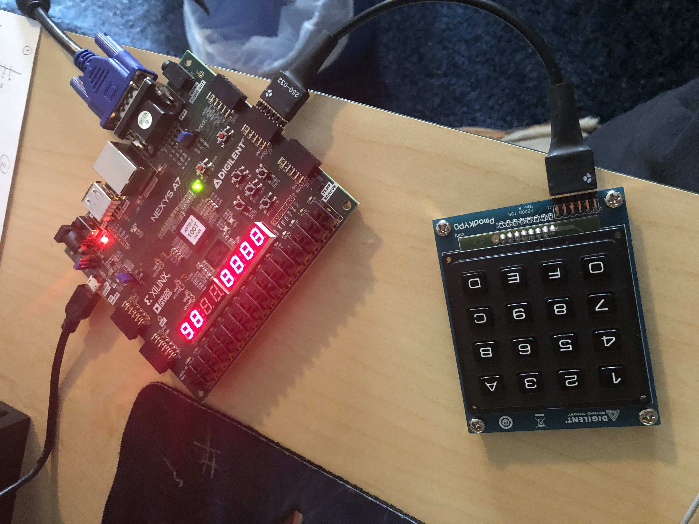

# CPE487
##  Take a look at some pictures / videos of my projects!
###  Lab 1: Project 1: LED Decoder 
 

###   Lab 2: Four-Digit Hex Counter
  Part 1: blue MODE jumper on JTAG -- Part 2: Moved blue MODE jumper to QSPI 
 

###   Lab 3: Bouncing Ball
  Part 1: Bouncing Ball with original code --- Part 2: Ball with modified code
 

###   Lab 4: Hex Calculator
  Part 1: Original Hex Calculator code [96 + 8A = 120]
 

  Part 2: Modified code: Addition without leading zeroes [12 + 895 = 8A7]
 

  Part 3: Modified code: Subtraction (also without leading zeroes) [89 - 12 = 77]
 

